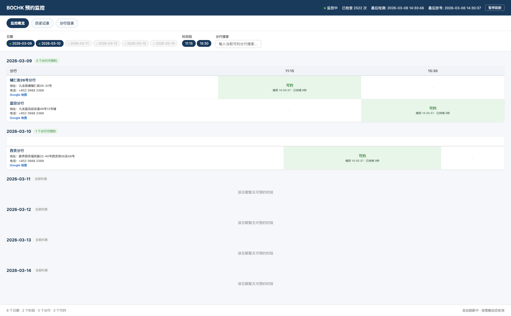
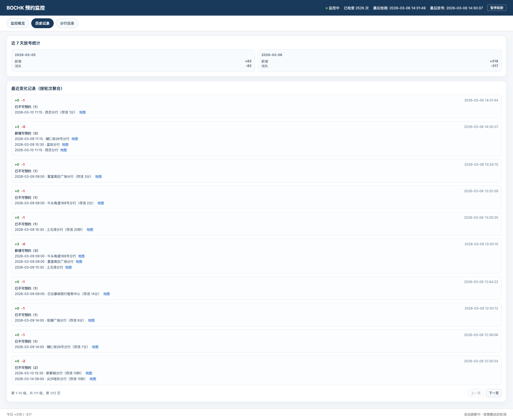
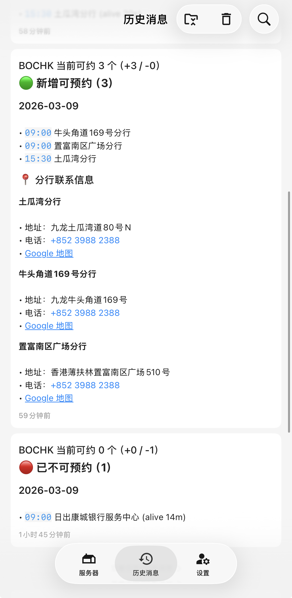

# BOCHK 预约监控工具

`bochk_check` 是一个 Rust 编写的预约可用性监控工具。
程序会定时轮询目标服务接口，识别可预约变化，发送 Bark 通知，并通过本地 Web 页面展示当前状态与历史变化。

## 相关文档

- [`AGENTS.md`](./AGENTS.md)
- [`docs/bochk_interfaces.md`](./docs/bochk_interfaces.md)

## 项目展示

| Web 页面（概览） | Web 页面（历史） |
| --- | --- |
| <a href="docs/web_img.png" target="_blank"></a> | <a href="docs/web_img_2.png" target="_blank"></a> |

手机提示（Bark）：

<a href="docs/bark_img.png" target="_blank"></a>

## 用途与免责声明

- 本项目仅用于接口研究、协议分析与自动化技术验证。
- 本项目不构成对任何第三方服务的授权、认可或商业建议。
- 使用者需自行确认行为符合目标服务条款、适用法律法规及所在地监管要求。
- 禁止将本项目用于恶意探测、规避风控或影响第三方系统稳定性的行为。
- 因使用、修改、部署或传播本项目产生的风险与责任，由使用者自行承担。

## 功能概览

- 轮询可预约日期并检测变化
- 命中可预约日期后自动深度查询时段/区域/分行
- Bark 多地址通知
- 本地 Web 状态页（监控概览、历史记录、分行目录）
- SQLite 持久化（当前快照 + 历史事件）
- 支持代理与动态轮询调度

## 快速开始

### 1. 编译

```bash
cargo build --release
```

### 2. 配置

```bash
cp data/config/app.toml.example data/config/app.toml
```

关键配置项：

- `proxy.url`：代理地址，留空为直连
- `monitor.interval_secs`：基础轮询间隔
- `monitor.max_fail_count`：异常告警阈值
- `bark.urls`：Bark 推送地址列表
- `web.enabled` / `web.port`：Web 开关与端口（默认仅本机访问）

### 3. 查看状态页

```text
http://127.0.0.1:32141
```

## 配置与环境变量

配置文件路径：`data/config/app.toml`

环境变量覆盖前缀：`BOCHK_`（优先级高于配置文件）

常用环境变量：

- `BOCHK_PROXY_URL`
- `BOCHK_MONITOR_INTERVAL_SECS`
- `BOCHK_MONITOR_MAX_FAIL_COUNT`
- `BOCHK_BARK_URLS`
- `BOCHK_WEB_ENABLED`
- `BOCHK_WEB_PORT`

## BOCHK API 说明（简化）

本项目依赖第三方预约系统的会话与配额接口。为降低误用风险，README 仅保留简化说明。

| 接口 | 方法 | 作用 |
| --- | --- | --- |
| `continueInput.action` | `GET` | 初始化会话上下文 |
| `jsonAvailableDateAndTime.action` | `POST` | 查询日期配额/单日时段 |
| `jsonAvailableBrsByDT.action` | `POST` | 按日期+时段查询区域/分行 |
| `jsonBrAvailableDT.action` | `POST` | 分行优先路径查询 |
| `jsonAvailableBrsByE.action` | `POST` | 按区域查询分行 |
| `jsonBranchDetail.action` | `GET` | 查询分行详情 |

更完整的历史接口分析请查看：

- [`docs/bochk_interfaces.md`](./docs/bochk_interfaces.md)

## 项目接口说明

| 路径 | 方法 | 说明 |
| --- | --- | --- |
| `/` | `GET` | Web 状态页 |
| `/api/status` | `GET` | 当前监控状态 |
| `/api/history` | `GET` | 历史变化汇总（支持分页参数） |
| `/api/branches` | `GET` | 分行目录 |

## 日志与数据

- 运行日志：`stderr`（`tracing`）
- 可选调试日志（开启 `logging.persist_jsonl=true` 后）：
  - `data/logs/api_log_YYYYMMDD.jsonl`
  - `data/logs/changes_YYYYMMDD.jsonl`

## 验证

```bash
cargo check
```

## 许可证

本项目采用 `Apache License 2.0`。

- 许可证文件：[`LICENSE`](./LICENSE)
- SPDX：`Apache-2.0`
