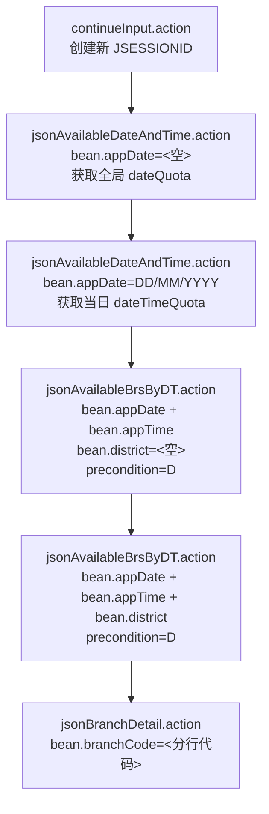
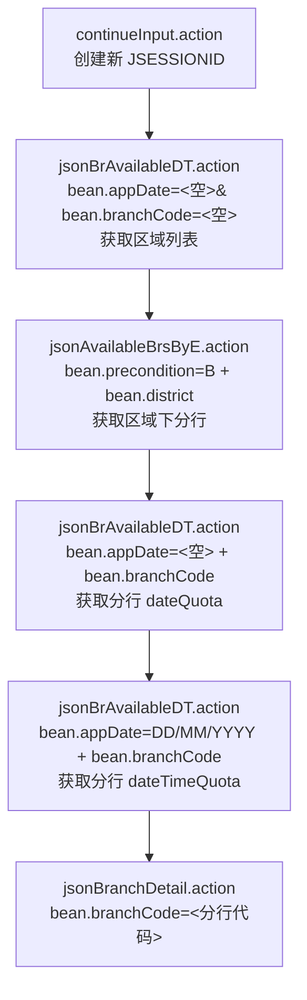
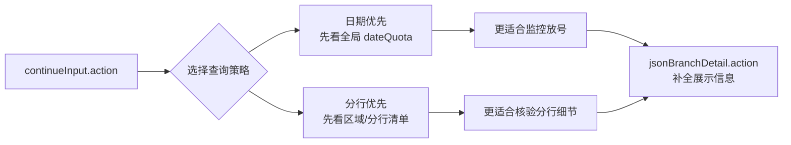

# BOCHK 预约监控工具

`bochk_check` 是一个用于监控中银香港（BOCHK）开户预约名额的 Rust 工具。程序会持续轮询公开预约接口，在发现可预约日期后进一步查询时段、区域和分行，并通过 Bark 推送告警，同时提供一个本地 Web 状态页用于实时查看当前监控状态。

`AGENTS.md` 主要面向 AI 协作规范；本文件面向项目使用者与维护者，提供运行、配置、测试和排障说明。

## 用途与免责声明

- 本项目仅用于接口研究、协议分析、自动化技术验证与学习交流
- 本项目不构成对任何第三方服务的授权、认可或商业建议
- 使用者应自行确认其行为符合目标服务的使用条款、适用法律法规及所在地监管要求
- 因使用、修改、部署或传播本项目所产生的任何风险、损失、争议或合规责任，均由使用者自行承担
- 如目标服务规则、接口行为或法律环境发生变化，应立即停止不符合要求的使用方式

如你计划将其用于实际环境，请先自行完成必要的合规审查与风险评估。

## 功能概览

- 实时轮询 `dateQuota`，检测可预约日期变化
- 发现可预约日期后，自动深度查询时段、区域、分行
- 支持 Bark 多端点推送，可同时通知多人
- 内置 Web 状态页与 JSON API，便于本地观察
- 失败自动重试，连续失败达到阈值后触发异常告警
- 多数运行参数每轮自动重载；Web 监听项仍需重启生效
- 支持 SOCKS5 / `socks5h://` 代理
- 可选将原始 API 响应与变化结果写入 JSONL（默认关闭）
- 支持“半点聚焦”动态轮询调度（`monitor.schedule`）

## 工作流程

```text
1. 请求 dateQuota（全部日期）
2. 找出状态为 A 的日期
3. 并发查询每个日期的可用时段
4. 对每个时段查询可用区域
5. 对每个可用区域并发查询可用分行
6. 聚合结果并更新 Web 状态
7. 在关键变化时发送 Bark 通知
```

当前实现中，仅状态为 `A` 的日期、时段、区域和分行会被继续深挖；`F` 与 `D` 都不会进入后续请求。

## 环境要求

- Rust 1.75+（建议使用稳定版）
- Cargo（随 Rust 安装）
- 可访问 BOCHK 目标接口的网络环境
- 可选：SOCKS5 代理
- 可选：Bark 推送地址

## 快速开始

### 1. 编译

```bash
cargo build --release
```

### 2. 复制配置

```bash
cp data/config/app.toml.example data/config/app.toml
```

### 3. 编辑配置

至少确认以下项目：

- `proxy.url`：代理地址；无代理可留空
- `monitor.interval_secs`：轮询间隔秒数
- `bark.urls`：Bark 推送地址列表；不需要通知可留空
- `web.enabled` / `web.port`：是否启用 Web 状态页及端口

### 4. 运行

```bash
./target/release/bochk_check
```

默认情况下，程序会读取基准目录下的 `data/config/app.toml`。基准目录优先取当前工作目录（若存在 `data/config`、`Cargo.toml` 或 `AGENTS.md`），否则回退到可执行文件所在目录。若配置文件不存在，程序会直接使用内置默认值启动。

### 5. 查看状态页

浏览器打开：

```text
http://127.0.0.1:32141
```

如果你修改了 `web.port`，请使用对应端口。

## 配置说明

配置文件使用 TOML，固定路径为 `data/config/app.toml`。该文件是可选的；未提供时会使用默认值，再由环境变量覆盖。

```toml
[proxy]
# 代理地址，留空表示直连
# 推荐 socks5h://，由代理完成 DNS 解析
url = "socks5h://127.0.0.1:1080"

[monitor]
# 轮询间隔（秒）
interval_secs = 10
# 连续失败多少次后开始进入告警逻辑
max_fail_count = 5

[monitor.schedule]
# 调度模式：half_hour_focus 或 fixed
mode = "half_hour_focus"
# 常规时段轮询间隔（秒）
normal_interval_secs = 60
# 半点前后聚焦窗口轮询间隔（秒）
focus_interval_secs = 10
# 午夜 00:00-00:05 轮询间隔（秒）
midnight_focus_interval_secs = 5
# 夜间轮询间隔（秒）
night_interval_secs = 180
# 半点聚焦窗口（分钟）
focus_minute_start = 25
focus_minute_end = 35
# 夜间窗口（小时）
night_hour_start = 1
night_hour_end = 6

[database]
# 启动时是否执行一次性历史重置
reset_history_on_start = false

[bark]
# 可配置多个 Bark 地址
urls = ["https://api.day.app/your_token_here"]

[logging]
# 是否额外写入 JSONL 调试日志（默认关闭）
persist_jsonl = false

[web]
# 是否开启内置 Web 服务
enabled = true
# Web 端口
port = 32141
```

### 配置项说明

| 配置项 | 类型 | 说明 |
| --- | --- | --- |
| `proxy.url` | `string` | SOCKS5 代理地址，支持 `socks5h://` |
| `monitor.interval_secs` | `u64` | 每轮检测后休眠时长 |
| `monitor.max_fail_count` | `u32` | 连续失败告警阈值；最小按 `1` 处理 |
| `monitor.schedule.mode` | `string` | 调度模式：`half_hour_focus` 或 `fixed` |
| `monitor.schedule.normal_interval_secs` | `u64` | 常规时段轮询间隔（秒） |
| `monitor.schedule.focus_interval_secs` | `u64` | 半点前后聚焦窗口轮询间隔（秒） |
| `monitor.schedule.midnight_focus_interval_secs` | `u64` | 00:00-00:05 聚焦窗口轮询间隔（秒） |
| `monitor.schedule.night_interval_secs` | `u64` | 夜间窗口轮询间隔（秒） |
| `monitor.schedule.focus_minute_start` | `u32` | 半点聚焦窗口起始分钟 |
| `monitor.schedule.focus_minute_end` | `u32` | 半点聚焦窗口结束分钟 |
| `monitor.schedule.night_hour_start` | `u32` | 夜间窗口起始小时 |
| `monitor.schedule.night_hour_end` | `u32` | 夜间窗口结束小时 |
| `database.reset_history_on_start` | `bool` | 启动时执行一次性历史重置（仅清空事件与当前快照） |
| `bark.urls` | `string[]` | Bark 推送地址，可为空 |
| `logging.persist_jsonl` | `bool` | 是否额外落盘 `api_log_*.jsonl` 与 `changes_*.jsonl`，默认关闭 |
| `web.enabled` | `bool` | 是否启动内置 Web 服务 |
| `web.port` | `u16` | Web 服务监听端口，默认 `32141` |

### 环境变量覆盖

程序支持使用 `BOCHK_` 前缀环境变量覆盖配置；环境变量优先级高于 `data/config/app.toml`。若未提供配置文件，也可完全通过环境变量和默认值运行。

| 环境变量 | 对应配置 | 默认值 |
| --- | --- | --- |
| `BOCHK_PROXY_URL` | `proxy.url` | 空字符串（直连） |
| `BOCHK_MONITOR_INTERVAL_SECS` | `monitor.interval_secs` | `30` |
| `BOCHK_MONITOR_MAX_FAIL_COUNT` | `monitor.max_fail_count` | `5` |
| `BOCHK_MONITOR_SCHEDULE_MODE` | `monitor.schedule.mode` | `half_hour_focus` |
| `BOCHK_MONITOR_NORMAL_INTERVAL_SECS` | `monitor.schedule.normal_interval_secs` | `60` |
| `BOCHK_MONITOR_FOCUS_INTERVAL_SECS` | `monitor.schedule.focus_interval_secs` | `10` |
| `BOCHK_MONITOR_MIDNIGHT_FOCUS_INTERVAL_SECS` | `monitor.schedule.midnight_focus_interval_secs` | `5` |
| `BOCHK_MONITOR_NIGHT_INTERVAL_SECS` | `monitor.schedule.night_interval_secs` | `180` |
| `BOCHK_MONITOR_FOCUS_MINUTE_START` | `monitor.schedule.focus_minute_start` | `25` |
| `BOCHK_MONITOR_FOCUS_MINUTE_END` | `monitor.schedule.focus_minute_end` | `35` |
| `BOCHK_MONITOR_NIGHT_HOUR_START` | `monitor.schedule.night_hour_start` | `1` |
| `BOCHK_MONITOR_NIGHT_HOUR_END` | `monitor.schedule.night_hour_end` | `6` |
| `BOCHK_DATABASE_RESET_HISTORY_ON_START` | `database.reset_history_on_start` | `false` |
| `BOCHK_BARK_URLS` | `bark.urls` | 空数组（关闭推送） |
| `BOCHK_LOGGING_PERSIST_JSONL` | `logging.persist_jsonl` | `false` |
| `BOCHK_WEB_ENABLED` | `web.enabled` | `true` |
| `BOCHK_WEB_PORT` | `web.port` | `32141` |

说明：

- `BOCHK_BARK_URLS` 使用英文逗号分隔多个地址
- `BOCHK_LOGGING_PERSIST_JSONL` 支持 `true/false`、`1/0`、`yes/no`、`on/off`
- `BOCHK_WEB_ENABLED` 支持 `true/false`、`1/0`、`yes/no`、`on/off`
- `BOCHK_DATABASE_RESET_HISTORY_ON_START` 支持 `true/false`、`1/0`、`yes/no`、`on/off`

## 运行时行为

### 日志

- 使用 `tracing` 输出日志
- 日志写到 `stderr`
- 默认日志级别为 `info`
- 可通过环境变量 `RUST_LOG` 覆盖，例如：`RUST_LOG=debug`

### 输出文件

默认情况下，程序不会额外写入文件日志，仅输出到 `stderr`。

当 `logging.persist_jsonl=true` 时，程序会在 `data/logs/` 目录额外写入以下调试文件：

- `api_log_YYYYMMDD.jsonl`：每次接口请求的原始响应
- `changes_YYYYMMDD.jsonl`：首轮结果与后续变化记录

这些调试文件属于运行期数据文件，不会再落在项目根目录。

### 通知策略

- 不再发送“启动即发现可预约”的专用通知；重启后只按持久化快照差异决定是否推送
- 仅在完成整轮深度查询且结果覆盖全部可预约日期后，才允许发送 Bark
- Bark 按“分行 + 日期 + 时间点”的完整明细快照做 diff，而不是只看 `dateQuota`
- 标题会优先显示“当前总可约点位数”，并附带本轮新增/消失数量
- 正文会列出具体分行、日期、时间，并在尾部附分行联系信息与地图链接
- Google 地图搜索关键词统一为 `中国银行 + 分行名`（例如 `中国银行 辅仁街26号分行`）
- 连续失败达到 `monitor.max_fail_count` 后会发送异常告警，之后每额外增加 10 次失败会重复告警

## 新发现（基于历史数据观察）

- 观察样本（`temp/bochk_check.db`）显示：放号/消号事件在 `xx:30` 前后更集中，常见于半点前后几分钟。
- UTC+8 深夜并非完全无变化，但总体频率较低；配置中已提供夜间降频与午夜短时聚焦策略。
- 以上为经验性规律，不保证 BOCHK 始终遵循；因此系统仍保留全时段轮询，只是动态调整间隔。

## BOCHK 接口说明

本节基于当前代码、历史抓包结论和线上实测结果整理，覆盖目前已发现的全部接口。除特别说明外，接口均属于同一业务域：

- Base URL：`https://transaction.bochk.com/whk/form/openAccount/`
- 认证方式：无显式登录，但依赖会话
- 会话要求：建议每轮先访问一次 `continueInput.action`，获取新的 `JSESSIONID`
- 请求头（POST 接口通用）：
  - `Content-Type: application/x-www-form-urlencoded; charset=UTF-8`
  - `X-Requested-With: XMLHttpRequest`
  - `Referer: https://transaction.bochk.com/whk/form/openAccount/continueInput.action`
  - `Origin: https://transaction.bochk.com`
  - `Accept-Language: zh-SG,zh-CN;q=0.9,zh-Hans;q=0.8`

### 接口总览

| 接口 | 方法 | 主要用途 |
| --- | --- | --- |
| `continueInput.action` | `GET` | 创建/刷新本轮会话，建立 `JSESSIONID` |
| `jsonAvailableDateAndTime.action` | `POST` | 日期优先模式下查询全局日期或指定日期时段 |
| `jsonAvailableBrsByDT.action` | `POST` | 日期优先模式下按“日期+时段”查询区域或分行 |
| `jsonBrAvailableDT.action` | `POST` | 分行优先模式下按“分行”查询区域、日期或时段 |
| `jsonAvailableBrsByE.action` | `POST` | 分行优先模式下按“区域”列出分行 |
| `jsonBranchDetail.action` | `GET` | 查询分行详情（名称、地址、电话等） |

### 常见状态码

| 状态码 | 含义 | 常见位置 |
| --- | --- | --- |
| `A` | 可预约 | `dateQuota`、`dateTimeQuota`、区域/分行 `value` 后缀 |
| `F` | 已满 | 同上；前端会显示为“已满”禁用项 |
| `D` | 不可选 / 禁用 | 同上；前端脚本不会把它渲染为可选项 |
| `SUCCESS` | 业务成功 | `eaiCode` |
| `WHKEQR888` | 业务错误 / 操作逾时 | `eaiCode`；前端文案为“操作逾时，请重新提交” |

### 1. `continueInput.action`

用途：初始化预约流程页面上下文，建立本轮会话。虽然它不是 JSON API，但后续接口通常依赖它返回的 `JSESSIONID`。

请求方式：

```http
GET /whk/form/openAccount/continueInput.action HTTP/1.1
```

请求参数：

- 无查询参数

返回内容：

- 返回 HTML 页面
- 响应头中会设置 `Set-Cookie`，包含新的 `JSESSIONID`
- 后续 API 建议复用同一个客户端/同一个 Cookie Jar

使用建议：

- 每轮探测开始时调用一次
- 若希望每轮完全隔离上下文，使用“新客户端 + 新会话”模式
- 当前程序即采用“每个 interval 新建客户端并初始化新会话”的方式运行

### 2. `jsonAvailableDateAndTime.action`

用途：日期优先模式的核心入口。既可查询全局 `dateQuota`，也可查询单日 `dateTimeQuota`。

请求方式：

```http
POST /whk/form/openAccount/jsonAvailableDateAndTime.action HTTP/1.1
```

#### 2.1 查询全局日期配额

请求体：

```text
bean.appDate=
```

请求参数：

| 参数 | 说明 |
| --- | --- |
| `bean.appDate` | 留空时表示查询全局日期列表 |

典型返回：

```json
{
  "dateQuota": {
    "20260312": "A",
    "20260311": "F",
    "20260310": "F"
  },
  "dateTimeQuota": null,
  "eaiCode": "SUCCESS",
  "eaiMsg": "OK"
}
```

关键字段：

| 字段 | 类型 | 说明 |
| --- | --- | --- |
| `dateQuota` | `object` | 键为 `YYYYMMDD`，值为 `A/F/D` 等状态 |
| `dateTimeQuota` | `null` | 查询全局日期时通常为空 |
| `eaiCode` | `string` | 业务状态码 |
| `eaiMsg` | `string|null` | 业务状态描述 |

#### 2.2 查询指定日期时段

请求体：

```text
bean.appDate=12/03/2026
```

请求参数：

| 参数 | 说明 |
| --- | --- |
| `bean.appDate` | 指定日期，格式为 `DD/MM/YYYY` |

典型返回：

```json
{
  "dateQuota": null,
  "dateTimeQuota": {
    "P01_F": "09:00",
    "P05_A": "14:00",
    "P09_D": "17:00"
  },
  "eaiCode": "SUCCESS",
  "eaiMsg": "OK"
}
```

关键字段：

| 字段 | 类型 | 说明 |
| --- | --- | --- |
| `dateTimeQuota` | `object` | 键格式为 `{slot_id}_{status}`，值为展示时间 |
| `dateQuota` | `null` | 查询时段时通常为空 |
| `eaiCode` | `string` | `SUCCESS` 表示成功；`WHKEQR888` 常见于操作逾时或流程上下文失效 |

适合场景：

- 做全局放号监控
- 在确认某天有号后，进一步定位具体时段

### 3. `jsonAvailableBrsByDT.action`

用途：日期优先模式下，围绕“日期 + 时段”继续深挖区域和分行。

请求方式：

```http
POST /whk/form/openAccount/jsonAvailableBrsByDT.action HTTP/1.1
```

共用请求参数：

| 参数 | 说明 |
| --- | --- |
| `bean.appDate` | 日期，格式 `DD/MM/YYYY` |
| `bean.appTime` | 时段 ID，例如 `P05` |
| `bean.district` | 区域编码；为空时查区域，有值时查分行 |
| `bean.precondition` | 日期优先模式固定为 `D` |

#### 3.1 查询可用区域

请求体：

```text
bean.appDate=12/03/2026&bean.appTime=P05&bean.district=&bean.precondition=D
```

典型返回：

```json
{
  "branchDistrictList": [
    {
      "messageCn": "西贡区",
      "value": "_sai_kung_district_A"
    },
    {
      "messageCn": "中西区",
      "value": "_central_western_district_F"
    }
  ],
  "availableBranchList": null,
  "eaiCode": "SUCCESS"
}
```

关键字段：

| 字段 | 类型 | 说明 |
| --- | --- | --- |
| `branchDistrictList` | `array` | 区域列表，`value` 后缀带状态 |
| `availableBranchList` | `null` | 查区域时为空 |
| `value` | `string` | 形如 `_sai_kung_district_A` |

#### 3.2 查询可用分行

请求体：

```text
bean.appDate=12/03/2026&bean.appTime=P05&bean.district=_sai_kung_district&bean.precondition=D
```

典型返回：

```json
{
  "availableBranchList": [
    {
      "messageCn": "西贡分行",
      "value": "617_F"
    },
    {
      "messageCn": "日出康城银行服务中心",
      "value": "952_A"
    }
  ],
  "branchDistrictList": null,
  "eaiCode": "SUCCESS"
}
```

关键字段：

| 字段 | 类型 | 说明 |
| --- | --- | --- |
| `availableBranchList` | `array` | 分行列表，`value` 后缀带状态 |
| `branchDistrictList` | `null` | 查分行时为空 |
| `value` | `string` | 形如 `952_A`，前半段是分行代码 |

适合场景：

- 在日期优先链路里，从“时段有号”继续追到“哪个区域/哪个网点”

### 4. `jsonBrAvailableDT.action`

用途：分行优先模式的核心接口。它能在同一个 endpoint 下，根据参数形态返回区域、分行日期或分行时段。

请求方式：

```http
POST /whk/form/openAccount/jsonBrAvailableDT.action HTTP/1.1
```

#### 4.1 查询区域入口

请求体：

```text
bean.appDate=&bean.branchCode=
```

典型返回：

```json
{
  "branchDistrictList": [
    {
      "messageCn": "西贡区",
      "value": "_sai_kung_district_A"
    }
  ],
  "dateQuota": null,
  "dateTimeQuota": null,
  "eaiCode": "SUCCESS"
}
```

#### 4.2 查询单分行可预约日期

请求体：

```text
bean.appDate=&bean.branchCode=952
```

典型返回：

```json
{
  "dateQuota": {
    "20260312": "A",
    "20260311": "F",
    "20260310": "F"
  },
  "branchDistrictList": null,
  "dateTimeQuota": null,
  "eaiCode": "SUCCESS"
}
```

#### 4.3 查询单分行指定日期时段

请求体：

```text
bean.appDate=12/03/2026&bean.branchCode=952
```

典型返回：

```json
{
  "dateQuota": null,
  "dateTimeQuota": {
    "P05_A": "14:00",
    "P09_D": "17:00"
  },
  "eaiCode": "SUCCESS"
}
```

共用关键字段：

| 字段 | 类型 | 说明 |
| --- | --- | --- |
| `branchDistrictList` | `array|null` | 查询区域入口时有值 |
| `dateQuota` | `object|null` | 查询单分行日期时有值 |
| `dateTimeQuota` | `object|null` | 查询单分行时段时有值 |
| `eaiCode` | `string` | 业务状态码 |

适合场景：

- 反向验证某个分行是否真的有号
- 建立“分行 -> 日期 -> 时段”的反查链路
- 为高价值分行做定点监控

### 5. `jsonAvailableBrsByE.action`

用途：分行优先模式下，按区域直接列出分行。

请求方式：

```http
POST /whk/form/openAccount/jsonAvailableBrsByE.action HTTP/1.1
```

请求体：

```text
bean.precondition=B&bean.district=_sai_kung_district
```

请求参数：

| 参数 | 说明 |
| --- | --- |
| `bean.precondition` | 分行优先模式固定为 `B` |
| `bean.district` | 区域编码，例如 `_sai_kung_district` |

典型返回：

```json
{
  "availableBranchList": [
    {
      "messageCn": "西贡分行",
      "value": "617_F"
    },
    {
      "messageCn": "日出康城银行服务中心",
      "value": "952_A"
    }
  ],
  "eaiCode": "SUCCESS"
}
```

关键字段：

| 字段 | 类型 | 说明 |
| --- | --- | --- |
| `availableBranchList` | `array` | 区域下分行列表 |
| `value` | `string` | 形如 `952_A`，前半段是分行代码 |
| `eaiCode` | `string` | 业务状态码 |

适合场景：

- 在已知区域的前提下快速拉分行清单
- 作为分行优先链路的第二步

### 6. `jsonBranchDetail.action`

用途：补充分行展示信息，不直接参与“是否有号”的判断。

抓包中的前端页面会在用户切换分行后调用该接口，并将返回的 `addressCn` / `telNo` 填入地址展示区域。

请求方式：

```http
GET /whk/form/openAccount/jsonBranchDetail.action?bean.branchCode=952 HTTP/1.1
```

请求参数：

| 参数 | 说明 |
| --- | --- |
| `bean.branchCode` | 分行代码，例如 `952` |

典型返回：

```json
{
  "nameTw": "日出康城銀行服務中心",
  "code": "952",
  "districtCode": "_sai_kung_district",
  "addressCn": "新界将军澳康城路1号The LOHAS 康城4楼413号铺",
  "nameCn": "日出康城银行服务中心",
  "nameEn": "The Lohas Banking Services Centre",
  "telNo": "+852 3988 2388"
}
```

关键字段：

| 字段 | 类型 | 说明 |
| --- | --- | --- |
| `code` | `string` | 分行代码 |
| `districtCode` | `string` | 所属区域编码 |
| `nameCn` / `nameEn` / `nameTw` | `string` | 多语言分行名 |
| `addressCn` / `addressEn` / `addressTw` | `string` | 多语言地址 |
| `telNo` | `string` | 电话 |

适合场景：

- Web 页面展示增强
- Bark 通知补充可读名称与地址
- 维护本地分行资料缓存

### 抓包验证出的两条主链路

抓包显示 BOCHK 前端至少存在两套并行可用的查询路径。当前项目主实现采用“日期优先”路径；“分行优先”路径可用于回退验证、精确追踪单分行、补充数据建模。

#### 日期优先路径（当前项目主路径）



适合场景：

- 快速全局扫盘，先确认“哪一天有号”
- 已知目标是“日期变化告警”
- 想用最少请求快速逼近可预约时段和分行

#### 分行优先路径（抓包已验证）



适合场景：

- 反向验证某个区域/分行是否真的可约
- 盯单个高价值分行（例如指定网点）
- 当日期优先链路返回业务错误时，做补充排查

#### 两条路径的关系



### 接口利用建议

- `continueInput.action`
  每轮探测的会话起点。适合在每轮监控开始时刷新上下文，避免上一轮的状态污染。

- `jsonAvailableDateAndTime.action`
  适合做“全局发现”。先用 `bean.appDate=` 快速拿全局日期，再对有号日期做单日时段深挖。

- `jsonAvailableBrsByDT.action`
  适合做“日期优先”的定向深挖。从日期和时段出发，逐步缩小到区域和分行。

- `jsonBrAvailableDT.action`
  适合做“分行优先”的反查和核验。可以从单个分行出发，追它有哪些日期、哪些时段还能约。

- `jsonAvailableBrsByE.action`
  适合做“区域枚举分行”。可先按区域缓存分行列表，再对重点分行做增量检查。

- `jsonBranchDetail.action`
  适合做“资料补全”。建议按 `branchCode` 建本地缓存，减少重复请求。

### 推荐的组合策略

- 主监控链路：`continueInput.action` + `jsonAvailableDateAndTime.action`
  用于最先发现全局放号。

- 深度确认链路：`jsonAvailableDateAndTime.action` + `jsonAvailableBrsByDT.action`
  用于从“有号日期”追到“有号时段/区域/分行”。

- 回退核验链路：`jsonBrAvailableDT.action` + `jsonAvailableBrsByE.action`
  当日期优先链路出现业务错误，或需要验证单个分行时使用。

- 展示增强链路：`jsonBranchDetail.action`
  用于 UI、通知、缓存分行资料。

## Web 接口

| 路径 | 方法 | 说明 |
| --- | --- | --- |
| `/` | `GET` | 内置状态页（静态 HTML） |
| `/api/status` | `GET` | 当前监控状态 JSON |
| `/api/history` | `GET` | 历史变化汇总与近 7 天统计（支持 `?page=1`） |
| `/api/branches` | `GET` | 当前分行目录（来自 SQLite `branches` 表） |

`/api/status` 主要字段：

- `updated_at`：最近一次刷新时间
- `last_release_at`：最近一次出现新增可约点位的时间
- `monitoring`：是否处于运行状态
- `total_checks`：成功请求次数
- `date_quota`：原始日期状态映射
- `dates`：格式化后的日期列表
- `time_slots`：已探测到的时间列表
- `branches`：按分行聚合后的可预约情况

`/api/history` 主要字段：

- `today`：今日新增/消失点位汇总
- `recent_days`：近 7 天按天聚合的新增/消失统计
- `recent_batches`：最近变化轮次（每轮包含 `+新增/-消失` 和具体点位列表）
- `recent_batches_pagination`：`recent_batches` 的分页信息

`/api/branches` 主要字段：

- `code`：分行代码
- `name`：分行名称
- `address_cn`：中文地址
- `tel_no`：联系电话
- `is_enabled`：是否启用（禁用分行不会参与通知和展示）
- `updated_at`：该分行资料最近一次写入数据库的时间

## 验证

当前仓库未保留自动化测试代码。对代码改动的最低验证方式建议使用：

```bash
cargo check
```

如需做运行态验证，可直接启动程序并观察日志、Web 状态页以及生成的 JSONL 输出。

## 构建与交叉编译

统一约定：所有目标平台二进制均通过 Docker 构建，且统一为 musl 版本。

### Docker 统一构建（推荐）

```bash
# Linux amd64 musl
./docker/build-binary.sh x86_64-unknown-linux-musl

# Linux arm64 musl
./docker/build-binary.sh aarch64-unknown-linux-musl linux/amd64
```

产物目录：

- `dist/<target>/bochk_check`

### Linux musl 静态编译

```bash
rustup target add x86_64-unknown-linux-musl
cargo build --release --target x86_64-unknown-linux-musl
```

### Windows

```bash
rustup target add x86_64-pc-windows-gnu
cargo build --release --target x86_64-pc-windows-gnu
```

## 项目结构

```text
.
├── src/
│   ├── main.rs        # 主循环与调度
│   ├── client.rs      # HTTP 客户端、重试、接口调用
│   ├── config.rs      # 配置加载与默认值
│   ├── models.rs      # 数据模型与 Web 状态结构
│   ├── parser.rs      # 解析、diff、格式化
│   ├── monitor.rs     # 深度查询流水线
│   ├── notifier.rs    # Bark 推送
│   ├── web.rs         # Web 服务
│   └── web.html       # 状态页前端
├── data/
│   ├── config/
│   │   └── app.toml.example
│   ├── file/
│   └── logs/
├── Cargo.toml
├── README.md
└── AGENTS.md
```

## 常见问题

### 没有收到 Bark 推送

- 确认 `bark.urls` 不为空
- 确认设备上的 Bark 服务可用
- 检查日志里是否有 `Bark 通知发送失败`

### Web 页面打不开

- 确认 `web.enabled = true`
- 确认端口未被占用
- 检查启动日志是否出现 `Web 服务绑定端口失败`

### 一直请求失败

- 优先检查代理地址是否可用
- 无代理时，确认当前网络是否可直连 BOCHK
- 可临时设置 `RUST_LOG=debug` 查看请求重试细节

## 当前限制

- 仓库当前未提供 `Dockerfile`
