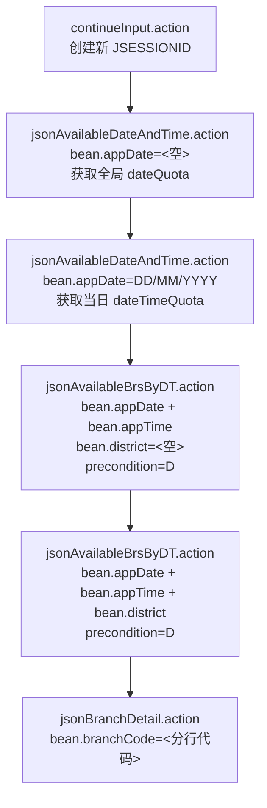
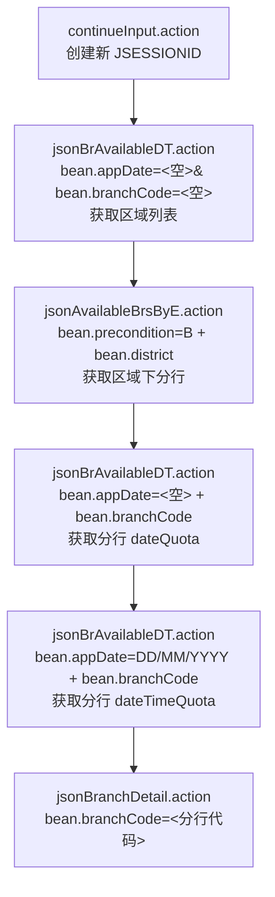
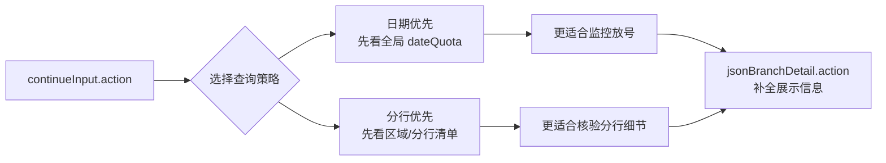

## BOCHK 接口说明

本节基于当前代码、历史抓包结论和线上实测结果整理，覆盖目前已发现的全部接口。除特别说明外，接口均属于同一业务域：

- Base URL：`https://transaction.bochk.com/whk/form/openAccount/`
- 认证方式：无显式登录，但依赖会话
- 会话要求：建议每轮先访问一次 `continueInput.action`，获取新的 `JSESSIONID`
- 请求头（POST 接口通用）：
  - `Content-Type: application/x-www-form-urlencoded; charset=UTF-8`
  - `X-Requested-With: XMLHttpRequest`
  - `Referer: https://transaction.bochk.com/whk/form/openAccount/continueInput.action`
  - `Origin: https://transaction.bochk.com`
  - `Accept-Language: zh-SG,zh-CN;q=0.9,zh-Hans;q=0.8`

### 接口总览

| 接口 | 方法 | 主要用途 |
| --- | --- | --- |
| `continueInput.action` | `GET` | 创建/刷新本轮会话，建立 `JSESSIONID` |
| `jsonAvailableDateAndTime.action` | `POST` | 日期优先模式下查询全局日期或指定日期时段 |
| `jsonAvailableBrsByDT.action` | `POST` | 日期优先模式下按“日期+时段”查询区域或分行 |
| `jsonBrAvailableDT.action` | `POST` | 分行优先模式下按“分行”查询区域、日期或时段 |
| `jsonAvailableBrsByE.action` | `POST` | 分行优先模式下按“区域”列出分行 |
| `jsonBranchDetail.action` | `GET` | 查询分行详情（名称、地址、电话等） |

### 常见状态码

| 状态码 | 含义 | 常见位置 |
| --- | --- | --- |
| `A` | 可预约 | `dateQuota`、`dateTimeQuota`、区域/分行 `value` 后缀 |
| `F` | 已满 | 同上；前端会显示为“已满”禁用项 |
| `D` | 不可选 / 禁用 | 同上；前端脚本不会把它渲染为可选项 |
| `SUCCESS` | 业务成功 | `eaiCode` |
| `WHKEQR888` | 业务错误 / 操作逾时 | `eaiCode`；前端文案为“操作逾时，请重新提交” |

### 1. `continueInput.action`

用途：初始化预约流程页面上下文，建立本轮会话。虽然它不是 JSON API，但后续接口通常依赖它返回的 `JSESSIONID`。

请求方式：

```http
GET /whk/form/openAccount/continueInput.action HTTP/1.1
```

请求参数：

- 无查询参数

返回内容：

- 返回 HTML 页面
- 响应头中会设置 `Set-Cookie`，包含新的 `JSESSIONID`
- 后续 API 建议复用同一个客户端/同一个 Cookie Jar

使用建议：

- 每轮探测开始时调用一次
- 若希望每轮完全隔离上下文，使用“新客户端 + 新会话”模式
- 当前程序即采用“每个 interval 新建客户端并初始化新会话”的方式运行

### 2. `jsonAvailableDateAndTime.action`

用途：日期优先模式的核心入口。既可查询全局 `dateQuota`，也可查询单日 `dateTimeQuota`。

请求方式：

```http
POST /whk/form/openAccount/jsonAvailableDateAndTime.action HTTP/1.1
```

#### 2.1 查询全局日期配额

请求体：

```text
bean.appDate=
```

请求参数：

| 参数 | 说明 |
| --- | --- |
| `bean.appDate` | 留空时表示查询全局日期列表 |

典型返回：

```json
{
  "dateQuota": {
    "20260312": "A",
    "20260311": "F",
    "20260310": "F"
  },
  "dateTimeQuota": null,
  "eaiCode": "SUCCESS",
  "eaiMsg": "OK"
}
```

关键字段：

| 字段 | 类型 | 说明 |
| --- | --- | --- |
| `dateQuota` | `object` | 键为 `YYYYMMDD`，值为 `A/F/D` 等状态 |
| `dateTimeQuota` | `null` | 查询全局日期时通常为空 |
| `eaiCode` | `string` | 业务状态码 |
| `eaiMsg` | `string|null` | 业务状态描述 |

#### 2.2 查询指定日期时段

请求体：

```text
bean.appDate=12/03/2026
```

请求参数：

| 参数 | 说明 |
| --- | --- |
| `bean.appDate` | 指定日期，格式为 `DD/MM/YYYY` |

典型返回：

```json
{
  "dateQuota": null,
  "dateTimeQuota": {
    "P01_F": "09:00",
    "P05_A": "14:00",
    "P09_D": "17:00"
  },
  "eaiCode": "SUCCESS",
  "eaiMsg": "OK"
}
```

关键字段：

| 字段 | 类型 | 说明 |
| --- | --- | --- |
| `dateTimeQuota` | `object` | 键格式为 `{slot_id}_{status}`，值为展示时间 |
| `dateQuota` | `null` | 查询时段时通常为空 |
| `eaiCode` | `string` | `SUCCESS` 表示成功；`WHKEQR888` 常见于操作逾时或流程上下文失效 |

适合场景：

- 做全局放号监控
- 在确认某天有号后，进一步定位具体时段

### 3. `jsonAvailableBrsByDT.action`

用途：日期优先模式下，围绕“日期 + 时段”继续深挖区域和分行。

请求方式：

```http
POST /whk/form/openAccount/jsonAvailableBrsByDT.action HTTP/1.1
```

共用请求参数：

| 参数 | 说明 |
| --- | --- |
| `bean.appDate` | 日期，格式 `DD/MM/YYYY` |
| `bean.appTime` | 时段 ID，例如 `P05` |
| `bean.district` | 区域编码；为空时查区域，有值时查分行 |
| `bean.precondition` | 日期优先模式固定为 `D` |

#### 3.1 查询可用区域

请求体：

```text
bean.appDate=12/03/2026&bean.appTime=P05&bean.district=&bean.precondition=D
```

典型返回：

```json
{
  "branchDistrictList": [
    {
      "messageCn": "西贡区",
      "value": "_sai_kung_district_A"
    },
    {
      "messageCn": "中西区",
      "value": "_central_western_district_F"
    }
  ],
  "availableBranchList": null,
  "eaiCode": "SUCCESS"
}
```

关键字段：

| 字段 | 类型 | 说明 |
| --- | --- | --- |
| `branchDistrictList` | `array` | 区域列表，`value` 后缀带状态 |
| `availableBranchList` | `null` | 查区域时为空 |
| `value` | `string` | 形如 `_sai_kung_district_A` |

#### 3.2 查询可用分行

请求体：

```text
bean.appDate=12/03/2026&bean.appTime=P05&bean.district=_sai_kung_district&bean.precondition=D
```

典型返回：

```json
{
  "availableBranchList": [
    {
      "messageCn": "西贡分行",
      "value": "617_F"
    },
    {
      "messageCn": "日出康城银行服务中心",
      "value": "952_A"
    }
  ],
  "branchDistrictList": null,
  "eaiCode": "SUCCESS"
}
```

关键字段：

| 字段 | 类型 | 说明 |
| --- | --- | --- |
| `availableBranchList` | `array` | 分行列表，`value` 后缀带状态 |
| `branchDistrictList` | `null` | 查分行时为空 |
| `value` | `string` | 形如 `952_A`，前半段是分行代码 |

适合场景：

- 在日期优先链路里，从“时段有号”继续追到“哪个区域/哪个网点”

### 4. `jsonBrAvailableDT.action`

用途：分行优先模式的核心接口。它能在同一个 endpoint 下，根据参数形态返回区域、分行日期或分行时段。

请求方式：

```http
POST /whk/form/openAccount/jsonBrAvailableDT.action HTTP/1.1
```

#### 4.1 查询区域入口

请求体：

```text
bean.appDate=&bean.branchCode=
```

典型返回：

```json
{
  "branchDistrictList": [
    {
      "messageCn": "西贡区",
      "value": "_sai_kung_district_A"
    }
  ],
  "dateQuota": null,
  "dateTimeQuota": null,
  "eaiCode": "SUCCESS"
}
```

#### 4.2 查询单分行可预约日期

请求体：

```text
bean.appDate=&bean.branchCode=952
```

典型返回：

```json
{
  "dateQuota": {
    "20260312": "A",
    "20260311": "F",
    "20260310": "F"
  },
  "branchDistrictList": null,
  "dateTimeQuota": null,
  "eaiCode": "SUCCESS"
}
```

#### 4.3 查询单分行指定日期时段

请求体：

```text
bean.appDate=12/03/2026&bean.branchCode=952
```

典型返回：

```json
{
  "dateQuota": null,
  "dateTimeQuota": {
    "P05_A": "14:00",
    "P09_D": "17:00"
  },
  "eaiCode": "SUCCESS"
}
```

共用关键字段：

| 字段 | 类型 | 说明 |
| --- | --- | --- |
| `branchDistrictList` | `array|null` | 查询区域入口时有值 |
| `dateQuota` | `object|null` | 查询单分行日期时有值 |
| `dateTimeQuota` | `object|null` | 查询单分行时段时有值 |
| `eaiCode` | `string` | 业务状态码 |

适合场景：

- 反向验证某个分行是否真的有号
- 建立“分行 -> 日期 -> 时段”的反查链路
- 为高价值分行做定点监控

### 5. `jsonAvailableBrsByE.action`

用途：分行优先模式下，按区域直接列出分行。

请求方式：

```http
POST /whk/form/openAccount/jsonAvailableBrsByE.action HTTP/1.1
```

请求体：

```text
bean.precondition=B&bean.district=_sai_kung_district
```

请求参数：

| 参数 | 说明 |
| --- | --- |
| `bean.precondition` | 分行优先模式固定为 `B` |
| `bean.district` | 区域编码，例如 `_sai_kung_district` |

典型返回：

```json
{
  "availableBranchList": [
    {
      "messageCn": "西贡分行",
      "value": "617_F"
    },
    {
      "messageCn": "日出康城银行服务中心",
      "value": "952_A"
    }
  ],
  "eaiCode": "SUCCESS"
}
```

关键字段：

| 字段 | 类型 | 说明 |
| --- | --- | --- |
| `availableBranchList` | `array` | 区域下分行列表 |
| `value` | `string` | 形如 `952_A`，前半段是分行代码 |
| `eaiCode` | `string` | 业务状态码 |

适合场景：

- 在已知区域的前提下快速拉分行清单
- 作为分行优先链路的第二步

### 6. `jsonBranchDetail.action`

用途：补充分行展示信息，不直接参与“是否有号”的判断。

抓包中的前端页面会在用户切换分行后调用该接口，并将返回的 `addressCn` / `telNo` 填入地址展示区域。

请求方式：

```http
GET /whk/form/openAccount/jsonBranchDetail.action?bean.branchCode=952 HTTP/1.1
```

请求参数：

| 参数 | 说明 |
| --- | --- |
| `bean.branchCode` | 分行代码，例如 `952` |

典型返回：

```json
{
  "nameTw": "日出康城銀行服務中心",
  "code": "952",
  "districtCode": "_sai_kung_district",
  "addressCn": "新界将军澳康城路1号The LOHAS 康城4楼413号铺",
  "nameCn": "日出康城银行服务中心",
  "nameEn": "The Lohas Banking Services Centre",
  "telNo": "+852 3988 2388"
}
```

关键字段：

| 字段 | 类型 | 说明 |
| --- | --- | --- |
| `code` | `string` | 分行代码 |
| `districtCode` | `string` | 所属区域编码 |
| `nameCn` / `nameEn` / `nameTw` | `string` | 多语言分行名 |
| `addressCn` / `addressEn` / `addressTw` | `string` | 多语言地址 |
| `telNo` | `string` | 电话 |

适合场景：

- Web 页面展示增强
- Bark 通知补充可读名称与地址
- 维护本地分行资料缓存

### 抓包验证出的两条主链路

抓包显示 BOCHK 前端至少存在两套并行可用的查询路径。当前项目主实现采用“日期优先”路径；“分行优先”路径可用于回退验证、精确追踪单分行、补充数据建模。

#### 日期优先路径（当前项目主路径）



适合场景：

- 快速全局扫盘，先确认“哪一天有号”
- 已知目标是“日期变化告警”
- 想用最少请求快速逼近可预约时段和分行

#### 分行优先路径（抓包已验证）



适合场景：

- 反向验证某个区域/分行是否真的可约
- 盯单个高价值分行（例如指定网点）
- 当日期优先链路返回业务错误时，做补充排查

#### 两条路径的关系



### 接口利用建议

- `continueInput.action`
  每轮探测的会话起点。适合在每轮监控开始时刷新上下文，避免上一轮的状态污染。

- `jsonAvailableDateAndTime.action`
  适合做“全局发现”。先用 `bean.appDate=` 快速拿全局日期，再对有号日期做单日时段深挖。

- `jsonAvailableBrsByDT.action`
  适合做“日期优先”的定向深挖。从日期和时段出发，逐步缩小到区域和分行。

- `jsonBrAvailableDT.action`
  适合做“分行优先”的反查和核验。可以从单个分行出发，追它有哪些日期、哪些时段还能约。

- `jsonAvailableBrsByE.action`
  适合做“区域枚举分行”。可先按区域缓存分行列表，再对重点分行做增量检查。

- `jsonBranchDetail.action`
  适合做“资料补全”。建议按 `branchCode` 建本地缓存，减少重复请求。

### 推荐的组合策略

- 主监控链路：`continueInput.action` + `jsonAvailableDateAndTime.action`
  用于最先发现全局放号。

- 深度确认链路：`jsonAvailableDateAndTime.action` + `jsonAvailableBrsByDT.action`
  用于从“有号日期”追到“有号时段/区域/分行”。

- 回退核验链路：`jsonBrAvailableDT.action` + `jsonAvailableBrsByE.action`
  当日期优先链路出现业务错误，或需要验证单个分行时使用。

- 展示增强链路：`jsonBranchDetail.action`
  用于 UI、通知、缓存分行资料。

